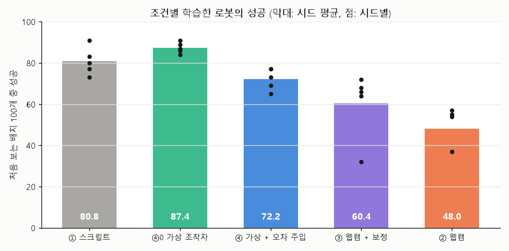

# M9 다섯 조건 학습·비교 결과 (2026-10-03~04)

- 학습: LeRobot 0.6.1 ACT 기본값, 2만 스텝·배치 8, 시드 1000·2000·3000 (조건마다 같음). RunPod (`runpod/run_m9.sh`).
- 평가: 고정 평가 배치 100개(시범에 안 씀), 에피소드 60초 제한(결과 보기 전에 정함), `PlacementTracker`.
- 결과 JSON: `experiments/eval/m9/`, 정리: `scripts/analyze_m9.py` → `experiments/m9_summary.json`, `docs/figures/m9_success.png`
- 모델: Hub `kheechan04/webcam-teach-robot-act-<조건>-s<시드>` (비공개)

## 결과 (처음 보는 배치 100개 중 성공)

| 조건 | 시드 1000 | 2000 | 3000 | 평균 | 들어 올리기 | 성공까지 중앙 |
|---|---|---|---|---|---|---|
| ① 스크립트 | 80 | 73 | 77 | **76.7** | 91% | 4.5초 |
| ④0 가상 조작자, 오차 없음 | 86 | 91 | 87 | **88.0** | 94% | 5.4초 |
| ④ 가상 조작자 + 깊이 오차 주입 | 77 | 65 | 69 | **70.3** | 82% | 5.5초 |
| ③ 웹캠 + 깊이 보정 | 68 | 66 | 64 | **66.0** | 90% | 19.9초 |
| ② 웹캠 | 54 | 37 | 57 | **49.3** | 72% | 24.6초 |

## 비교 (같은 시드끼리 차이)

95% 구간은 평가 배치 100개와 시드를 함께 다시 뽑는 부트스트랩(5,000번). 시드가 3개뿐이라 구간은 대략적이다.

| 비교 | 시드별 | 평균 | 95% 구간 |
|---|---|---|---|
| 웹캠 시범의 손해 (② − ①) | −26, −36, −20 | **−27.3** | −39 ~ −15 |
| 깊이 오차만의 몫 (④ − ④0) | −9, −26, −18 | **−17.7** | −29 ~ −7 |
| 보정으로 회복 (③ − ②) | +14, +29, +7 | **+16.7** | +2 ~ +31 |
| 보정해도 남는 손해 (③ − ①) | −12, −7, −13 | −10.7 | −20 ~ −0.3 |
| 조종 코드를 거친 효과 (④0 − ①) | +6, +18, +10 | +11.3 | +3 ~ +21 |
| 사람 시범의 추가 손해 (② − ④) | −23, −28, −12 | −21.0 | −33 ~ −8 |

여섯 비교 모두 세 시드에서 방향이 같았다.

## 보강 1: 시드 5개 (2026-10-04, 시드 4000·5000 추가)

| 조건 | 1000 | 2000 | 3000 | 4000 | 5000 | 평균 |
|---|---|---|---|---|---|---|
| ④0 가상, 오차 없음 | 86 | 91 | 87 | 89 | 84 | 87.4 |
| ① 스크립트 | 80 | 73 | 77 | 91 | 83 | 80.8 |
| ④ 가상 + 오차 주입 | 77 | 65 | 69 | 77 | 73 | 72.2 |
| ③ 웹캠 + 보정 | 68 | 66 | 64 | 72 | **32** | 60.4 |
| ② 웹캠 | 54 | 37 | 57 | 55 | 37 | 48.0 |

| 비교 (같은 시드끼리) | 시드별 | 평균 | 95% 구간 |
|---|---|---|---|
| 웹캠 시범의 손해 (② − ①) | −26, −36, −20, −36, −46 | −32.8 | −44 ~ −22 |
| 깊이 오차만의 몫 (④ − ④0) | −9, −26, −18, −12, −11 | −15.2 | −24 ~ −7 |
| 보정으로 회복 (③ − ②) | +14, +29, +7, +17, **−5** | +12.4 | **−0.8 ~ +24.8** |

- ③ 시드 5000이 32로 크게 낮았다(들어 올리기 79%, 들고 나서 실패 47번). 이 하나로 "보정으로 회복"의 95% 구간이 0을 걸치게 됐다 — **시드 5개 중 4개에서 회복, 평균 +12%p, 통계적으로는 확정할 수 없다.** 웹캠 조건(②·③)은 시드에 따라 크게 흔들린다(② 37~57, ③ 32~72). 10만 스텝 학습(보강 3)으로 학습량 부족 때문인지 확인한다.
- 나머지 두 비교는 시드 5개에서도 다섯 번 모두 같은 방향이다.

## 보강 2: 깊이 오차 크기를 바꿔 보기 (용량-반응, 가상 조작자, 시드 3개)

| 깊이 오차 배율 | 시드 1000·2000·3000 | 평균 | 시범 만들 때 첫 시도 성공 (50개 중) |
|---|---|---|---|
| 0 (④0) | 86, 91, 87 | 88.0 | 50 |
| 0.5 | 82, 88, 92 | 87.3 | 48 |
| 1 (④, 실측 크기) | 77, 65, 69 | 70.3 | 41 |
| 2 | 49, 53, 74 | 58.7 | 32 |

- 오차가 클수록 학습한 로봇의 성공률이 떨어진다 — 깊이 오차가 원인이라는 근거. 0.5배까지는 손해가 거의 없고 실측 크기에서 크게 떨어진다. 오차를 절반으로만 줄여도 손해 대부분이 사라질 수 있다는 뜻이다(③의 보정은 자세 간 치우침을 약 60% 줄였다, `08-depth-correction.md`).
- 배율은 로그 공간에서 곱했다(자세 치우침과 흔들림 모두). 시범 수는 0.5배 50개, 2배 46개(실패 배치 제외).

## 보강 3: 조건 ⑤ 사람 시범 + 깊이 오차 거의 없음 (손목 마커, 시드 5개)

- 녹화: `docs/09-recording.md` 세션 m8b, 마커 정확도: `docs/12-marker.md`(자세 간 오차 −0.9~+1.2 cm). ⑤ 50개 모두 첫 시도 성공, 성공까지 중앙 18.5초.

| 조건 | 1000 | 2000 | 3000 | 4000 | 5000 | 평균 |
|---|---|---|---|---|---|---|
| ⑤ 웹캠 + 마커 | 71 | 46 | 58 | 61 | 61 | **59.4** |
| ③ 웹캠 + 보정 | 68 | 66 | 64 | 72 | 32 | 60.4 |
| ② 웹캠 | 54 | 37 | 57 | 55 | 37 | 48.0 |

| 비교 (같은 시드끼리) | 시드별 | 평균 | 95% 구간 |
|---|---|---|---|
| 사람 시범에서 깊이 오차를 없애면 (⑤ − ②) | +17, +9, +1, +6, +24 | +11.4 | −0.2 ~ +23.0 |
| 깊이 오차가 없어도 남는 사람 시범 손해 (⑤ − ①) | −9, −27, −19, −30, −22 | **−21.4** | −31 ~ −12 |
| 마커 vs 보정 (⑤ − ③) | +3, −20, −6, −11, +29 | −1.0 | −17 ~ +17 |
| 사람이 바로잡는 과정의 추가 몫 ((② − ⑤) − (④ − ④0)) | −8, +17, +17, +6, −13 | +3.8 | −12 ~ +20 |

- **깊이 오차가 없어도 사람 웹캠 시범은 스크립트보다 약 21%p 낮다.** 웹캠 시범 손해(② − ①, −33%p)의 대부분은 깊이 오차가 아니라 사람 시범의 특성(느림·망설임·헛집기·긴 시범 → 적은 반복 학습)에서 온다. 학습량 몫은 10만 스텝 학습으로 확인 중.
- **사람 시범에서 깊이 오차의 몫은 약 11%p**(⑤ − ②, 5개 중 5개 같은 방향, 구간 하한이 0에 걸침). 가상 조작자에서 잰 깊이 오차의 몫(④ − ④0, 약 15%p)과 비슷하다 — **"사람이 깊이 오차를 바로잡는 과정"이 추가로 손해를 키운다는 증거는 없었다**(+3.8, 구간 −12~+20).
- **웹캠만으로 한 보정(③)이 마커(⑤)와 같은 수준까지 왔다**(평균 60.4 vs 59.4). 깊이를 거의 정확하게 재도 그 이상 좋아지지 않았으므로, ③은 깊이 오차로 회복할 수 있는 몫을 대부분 회복한 것으로 보인다.
- 집게를 처음 닫는 위치(정책, 시드 3개 × 30판): ⑤ |x| 중앙 8.4 mm, 흩어짐 7.3(③ 4.0·7.2, ② 8.7·12.2). ⑤는 흩어짐이 작지만 평균이 큐브 뒤쪽 약 7 mm로 치우친다. **시범에서도 마커 세션은 ②·⑤ 모두 뒤쪽 약 5 mm에서 집었다**(⑤ −4.8 ± 4.0, 같은 날 ② −5.3 ± 5.5; 첫 세션 ② −2.4 ± 5.5, ③ +1.4 ± 4.1) — 마커가 아니라 그날의 집는 습관이고, 정책이 그대로 배웠다. ⑤ 시범은 집는 위치의 흩어짐이 가장 작다(4.0 mm).
- 섞인 것: ⑤는 ②·③보다 하루 뒤에 녹화했다(같은 배치의 ② 20개가 약 3초 빨라짐 — 연습 효과). 손목 카드 때문에 집기 잠금 시간이 늘었다(⑤ 26%, 같은 세션 ② 22%, 첫 세션 13~14%).

## 연구 질문에 대한 답 (이 실험 조건에서)

1. **단안 웹캠 시범은 성공률을 얼마나 깎나:** 스크립트 시범 대비 평균 27%p(76.7 → 49.3). 웹캠 시범으로 배운 로봇은 느리고(성공까지 중앙 24.6초 vs 4.5초) 시드에 따라 크게 흔들린다(37~57).
2. **그중 깊이 오차의 몫:** 사람 없이 깊이 오차만 넣고 뺀 비교(④0 → ④)에서 평균 18%p. 같은 조종 코드를 거친 가상 조작자 기준이다.
3. **보정하면 얼마나 회복되나:** 같은 사람이 보정을 켜고 녹화한 시범(③)이 평균 17%p 높았다. ①과의 차이 27%p 중 약 60%. 들어 올리기 비율이 72% → 90%로 가장 크게 좋아졌다 — 보정이 고친 것이 집으러 가는 손(집고 기울인 손)의 깊이 치우침이다.

## 녹화 단계와의 대비 (가장 중요한 관찰)

녹화할 때 ②와 ③은 성공 50/50 vs 50/50, 성공까지 시간도 차이가 없었다(짝 비교 p = 0.42, `docs/09-recording.md`). 사람이 화면을 보며 바로잡기 때문이다. 그런데 그 시범으로 학습한 로봇은 세 시드 모두 ③이 높았다. **조종 성능으로는 보이지 않던 깊이 오차의 영향이 학습 결과에는 남는다.** 관련 연구(AnyTeleop, TeleOpBench)는 조종 성능까지 비교했다(`docs/07-related-work-v2.md`).

## 왜 다른가 — 학습한 로봇이 어떻게 실패하나 (2026-10-04)

### 실패 유형 (시드 3개 × 평가 배치 100개 = 300번)

| 조건 | 성공 | 큐브를 건드려 1 cm 넘게 밀었지만 못 듦 | 들었다가 실패 | 안 건드림 |
|---|---|---|---|---|
| ④0 가상, 오차 없음 | 264 | **13** | 18 | 5 |
| ① 스크립트 | 230 | 20 | 43 | 7 |
| ④ 가상 + 깊이 오차 주입 | 211 | **48** | 36 | 5 |
| ③ 웹캠 + 보정 | 198 | **30** | 72 | 0 |
| ② 웹캠 | 148 | **70** | 69 | 13 |

깊이 오차가 큰 쪽(④, ②)에서 "집지 못하고 밀기만 하는" 실패가 두세 배 많다. 시범에서는 ②·③ 모두 절반쯤이 집기 전에 큐브를 2 mm 넘게 건드렸고(③이 조금 더 많음), ④ 시범은 한 번도 건드리지 않았다 — 로봇이 "미는 동작"을 따라 한 것이 아니다.

### 집게를 처음 닫는 위치 (`scripts/probe_policy_grasp.py`, 모델 12개 × 평가 배치 앞 30개, 노트북 CPU)

집게를 처음 닫는 순간 집게 끝 − 큐브 중심(mm). x = 앞뒤(웹캠 깊이 방향), y = 좌우.

| 조건 (90판) | 성공 | x 평균 ± 흩어짐 | \|x\| 중앙 | y 평균 ± 흩어짐 | \|y\| 중앙 | x·y 모두 5 mm 안 | 닫기 횟수 |
|---|---|---|---|---|---|---|---|
| ④0 | 81 | −2.8 ± 6.5 | 3.4 | −6.8 ± 4.8 | 7.5 | 24% | 3.5 |
| ④ | 68 | −3.7 ± 4.8 | 3.5 | −10.0 ± 6.5 | 10.0 | 13% | 7.8 |
| ③ | 54 | −5.0 ± 7.2 | 4.0 | −9.7 ± 10.0 | 10.4 | 10% | 4.1 |
| ② | 41 | −8.5 ± 12.2 | **8.7** | −13.2 ± 10.9 | 14.3 | 6% | 6.7 |

- **② vs ③ (사람 시범): ②의 로봇은 앞뒤(깊이 방향)로 두 배 더 어긋난 곳에서 집게를 닫는다**(|x| 중앙 8.7 vs 4.0 mm, 흩어짐 12.2 vs 7.2). 집기 허용 오차가 앞뒤 약 0.5~1 cm라(`03-task.md`) 이 차이가 헛집기·밀기로 이어진다. 좌우도 더 어긋나지만(깊이 오차는 좌우로도 번진다, `hand_point_camera`) 앞뒤 차이가 가장 크다.
- **④ vs ④0 (가상 조작자): 앞뒤 위치는 비슷하고, 좌우가 더 어긋나며 닫기를 두 배 더 반복한다.** 가상 조작자의 깊이 오차는 프레임마다 흔들림이 커서(집기 직전 떨림 0.70 vs 0.08 mm) 정책이 "언제 닫을지"가 불안정해진 것으로 보인다. 즉 깊이 오차가 정책을 망치는 길이 사람 시범과 가상 시범에서 조금 다르다.
- 모든 조건에서 y가 −6~−13 mm로 치우친 것은 집게 모양(고정 턱이 한쪽에 있음) 때문으로 보이며 조건 공통이다.

**정리:** 깊이 오차가 남은 시범으로 배운 로봇은 집으러 갈 때 큐브 위치를 덜 정확하게 맞춘다 — 사람 시범(②)에서는 특히 웹캠 깊이 방향(앞뒤)으로. 이것이 "밀기만 하고 못 집는" 실패와 낮은 성공률로 나타난다.

### 시범 쪽 원인: 집기 직전, 앞뒤 움직임이 큐브 위치와 상관없어진다 (`scripts/analyze_action_divergence.py`)

집기 직전 구간(집게 열림, 큐브가 바닥, 집게 끝이 큐브에서 6 cm 안, 움직이는 프레임)에서, 집게 끝이 큐브보다 앞/뒤(또는 좌/우)에 있을 때 다음 0.3초 동안 **큐브 쪽으로** 움직였는지를 봤다. 큐브 쪽으로 고쳐 가는 시범이라면 "큐브까지 남은 거리"와 "움직인 방향"이 반대 부호로 강하게 묶인다(상관 −1에 가까움).

| 조건 | 앞뒤(x, 웹캠 깊이 방향) 상관 | 큐브 쪽으로 움직인 비율 | 좌우(y) 상관 | 큐브 쪽 비율 |
|---|---|---|---|---|
| ④0 가상, 오차 없음 | −0.95 | 96% | −0.98 | 98% |
| ④ 가상 + 오차 주입 | **+0.09** | 57% | −0.75 | 74% |
| ③ 웹캠 + 보정 | −0.24 | 63% | −0.35 | 64% |
| ② 웹캠 | **−0.08** | 55% | −0.31 | 60% |

- 깊이 오차가 있으면 **앞뒤 움직임이 큐브 위치와 거의 무관해진다**(④0 −0.95 → ④ +0.09, 큐브 쪽 96% → 57%). 좌우는 덜 무너진다(−0.98 → −0.75).
- 사람 시범도 같다: ②의 앞뒤 움직임은 큐브 위치와 거의 상관없고(−0.08, 큐브 쪽 55% ≈ 반반), 보정한 ③은 더 묶여 있다(−0.24, 63%). 차이 −0.16, 시범을 다시 뽑는 부트스트랩 95% 구간 [−0.26, −0.06]. **좌우는 ②·③ 차이가 없다**(−0.05, [−0.16, +0.07]).
- 해석: 집으려고 손을 모으고 기울이는 동안 웹캠이 읽는 깊이가 손 자세 때문에 오르내려, 로봇이 앞뒤로 움직이는데 그 움직임은 큐브 위치와 상관이 없다. 사람은 결국 바로잡아 집기에 성공하지만, 시범의 앞뒤 움직임 상당 부분이 "잡음"이 된다. 로봇은 그 시범에서 "큐브가 앞에 있으면 앞으로" 같은 규칙을 앞뒤 방향으로는 잘 배우지 못하고, 그래서 앞뒤로 어긋난 곳에서 집게를 닫는다(위 표, ② |x| 8.7 mm vs ③ 4.0 mm). 보정은 이 잡음을 일부 줄인다.
- 같은 상황에서 시범끼리 행동 방향이 얼마나 다른지(Belkhale식 들쭉날쭉함, 이웃 5개 비교)는 ④0 0.02 → ④ 0.55로 크게 갈렸지만 ②·③은 0.64·0.65로 구분되지 않았다 — 사람 시범은 원래 들쭉날쭉해서 전체 방향 차이로는 안 보이고, **앞뒤 성분이 큐브 위치와 묶여 있는가**로 봐야 차이가 보인다.

## 아직 설명하지 못한 것

- ~~왜 ③의 시범이 학습에 더 좋은가~~ → 위 "시범 쪽 원인"에서 찾음(앞뒤 움직임과 큐브 위치의 상관). 아래는 그 전에 본 지표들이다. 시범 자체를 비교한 지표(`scripts/analyze_demos.py`, `experiments/demo_quality.json`)로는 ②와 ③이 구분되지 않았다: 집기 직전 2초 앞뒤 떨림 0.68 vs 0.81 mm(중앙), 헛집기 1 vs 2번, 집을 때 집게-큐브 위치 흩어짐(표준편차) x 5.5/4.1, y 4.5/6.2 mm. 깊이 오차가 떨림을 만든다는 것은 가상 조작자에서 확인됐다(④0 0.08 → ④ 0.70 mm). 처음 계산에서 "③의 떨림이 4.5배 작다"가 나왔지만, 시범 대부분이 계산에서 빠진 오류였고 고친 결과가 위의 값이다.
- 후보: 화면(카메라 이미지)과 행동의 관계가 시범마다 얼마나 일관된가 — 깊이 치우침이 자세마다 다르면, 같은 장면에서 손 자세에 따라 로봇 위치가 달라진다. 확인하지 않았다.
- **④0이 ①보다 높은 이유**(+11%p, 세 시드 모두): 같은 경유점이지만 조종 코드의 평활·집기 잠금을 거치면서 움직임이 부드러워지고, 집기 전후에 멈추는 시간(0.9초 vs 0.5초)이 길다. 정책이 따라 하기 쉬운 시범일 수 있다. 확인하지 않았다.

## 이 실험으로 말할 수 있는 것과 없는 것 (2026-10-04 정리)

| 질문 | 근거 | 말할 수 있나 |
|---|---|---|
| 깊이 오차는 그 자체로 손해인가 | ④0 → ④ (사람 없음), 용량-반응(진행 중) | 예 |
| 같은 사람의 시범에서 깊이 오차를 줄이면 좋아지나 | ② → ③ (+17%p, 사람 고정) | 예 |
| 사람 시범의 추가 손해(② − ④ = −21%p) 중 "사람이 깊이 오차를 바로잡는 과정"의 몫 | 사람 + 깊이 오차 없음 조건이 없음 | **아니오** |

② − ④에는 (1) 사람이 깊이 오차를 바로잡는 과정, (2) 깊이와 무관한 사람 시범 특성(느림, 망설임, 헛집기, 큐브 건드리기), (3) 시범이 길어 덜 반복 학습된 것이 섞여 있다. (3)은 10만 스텝 학습(진행 중)으로 확인한다. (1)과 (2)는 웹캠으로는 "사람 + 깊이 오차 없음" 조건을 만들 수 없어 나눌 수 없다 — 다른 입력 장치(조종용 팔 등)와의 비교가 필요하다. 그래서 "사람 시범의 손해 중 깊이 몫이 몇 %"라는 표현은 쓰지 않고, 깊이 오차의 효과는 사람 없는 비교와 같은 사람 안의 비교로만 말한다. ②→③의 +17%p는 사람 시범 손해 중 **적어도 이만큼은 깊이 오차와 엮여 있다**는 하한으로 읽는다(보정이 오차를 절반쯤만 줄였으므로).

## 한계

- 시범자 1명(오른손), 과제 1개, 시뮬레이션만, 시드 3개.
- 학습량은 조건마다 같은 2만 스텝이라, 시범이 긴 ②·③은 시범 하나를 보는 횟수가 적다(약 4에폭 vs 17에폭). ②와 ③은 길이가 비슷해(23.2 vs 26.0초 중앙) 둘의 비교에는 영향이 작지만, ①·④와의 비교에는 섞여 있다.
- ④의 깊이 오차는 M5 자세-치우침 모델과 ② 시범의 손 자세로 만든 것이라, 모델이 놓친 오차(같은 자세로 보이는데 다르게 틀리는 부분)는 들어가지 않았다.
- 사람이 정확한 장비(조종용 팔 등)로 보인 조건이 없어서 "사람 시범의 추가 손해"(② − ④) 중 웹캠 탓인 부분은 가를 수 없다.
- 평가 일부(② 시드 1000, ① 시드 3000)는 서버 GPU가 사라져 CPU로 돌았다. 같은 모델·같은 배치라 결과는 같아야 하며, 시간만 더 걸렸다.

## 서버에서 겪은 일 (재현용 기록)

학습 15번에 RunPod 서버 4대를 썼다. 토큰 인증 실패, 학습 환경에 cv2 누락(프로젝트의 uv 설정이 적용됨), 수동 중단이 서버 종료로 이어짐, 컨테이너 디스크 30 GB가 참(uv 캐시 11.6 GB), **RTX 4000 Ada 서버 두 대가 각각 몇 시간 뒤 GPU를 잃음**(NVML 오류). 모두 `run_m9.sh`에 반영했다(환경 검사, 중복 실행 잠금, 끝까지 돌았을 때만 서버 끄기, 체크포인트·캐시 정리, 학습 전 GPU 검사, 이어 하기). 마지막 4개는 RTX 4090에서 한 번에 18분씩.
